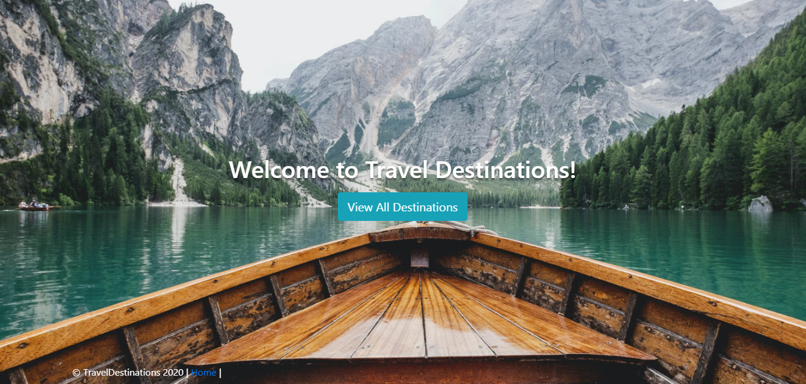
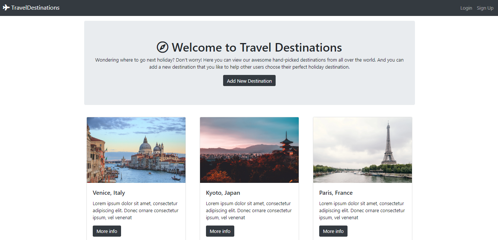

# Travel Destinations

## Table of contents

- [Introduction](#Introduction)
- [Demo](#demo)
- [Features](#features)
- [Technologies](#technologies)
- [Run](#run)
- [Sources](#sources)
- [License](#license)

## Introduction

A web application that allows users to add their favorite travel destinations and discover places added by others.

## Demo

This application is deployed on Heroku and can be accessed through the following link:

## Technologies

The application is built with:

- Node.js version: 10.16.3
- MongoDB version: 4.2.0
- Express version: 4.17.1
- Bootstrap version: 4.4.1
- FontAwesome version: 5.13.0
- Mapquest API: used for geocoding
- Mapbox API: used to show the maps

## Features

The application allows users to do the following things:

- Create an account, login or logout
- Browse available destinations added by other users
- Check their location on map
- Add, modify, or delete their comments
- Add, modify, or delete their destinations
- A user must be logged in to add a comment or a destination

## Run

To run the application, you have to run npm install to install the required packages in the package.json. Then you have to set your own environmental variables. For security reasons, some variables have been hidden from view and used as environmental variables with the help of dotenv package. Below are the variables that you need to set in order to run the application:

- DATABASEURL: this is the connection string of your MongoDB Atlas database.
- GEOCODER_PROVIDER: the name of the geocoder API that is used to geocode the longitude and latitude entered by users when they create a new destination.
- GEOCODER_API_KEY: the key that you will get when you set up an account for any API that you will use for geocoding.

## Sources

This application was created after finishing [The Web Developer Bootcamp](https://www.udemy.com/course/the-web-developer-bootcamp/) course on Udemy by Colt Steele. In the course, an application called YelpCamp was created, which is similar to this one. The main difference is that YelpCamp used Google maps to show the maps, while TravelDestinations uses Mapquest and Mapbox. The idea of the website is also a bit different.

## License

- MIT License
- Copyright 2020 © [Maryam AJ.](https://github.com/maryam-aj)
